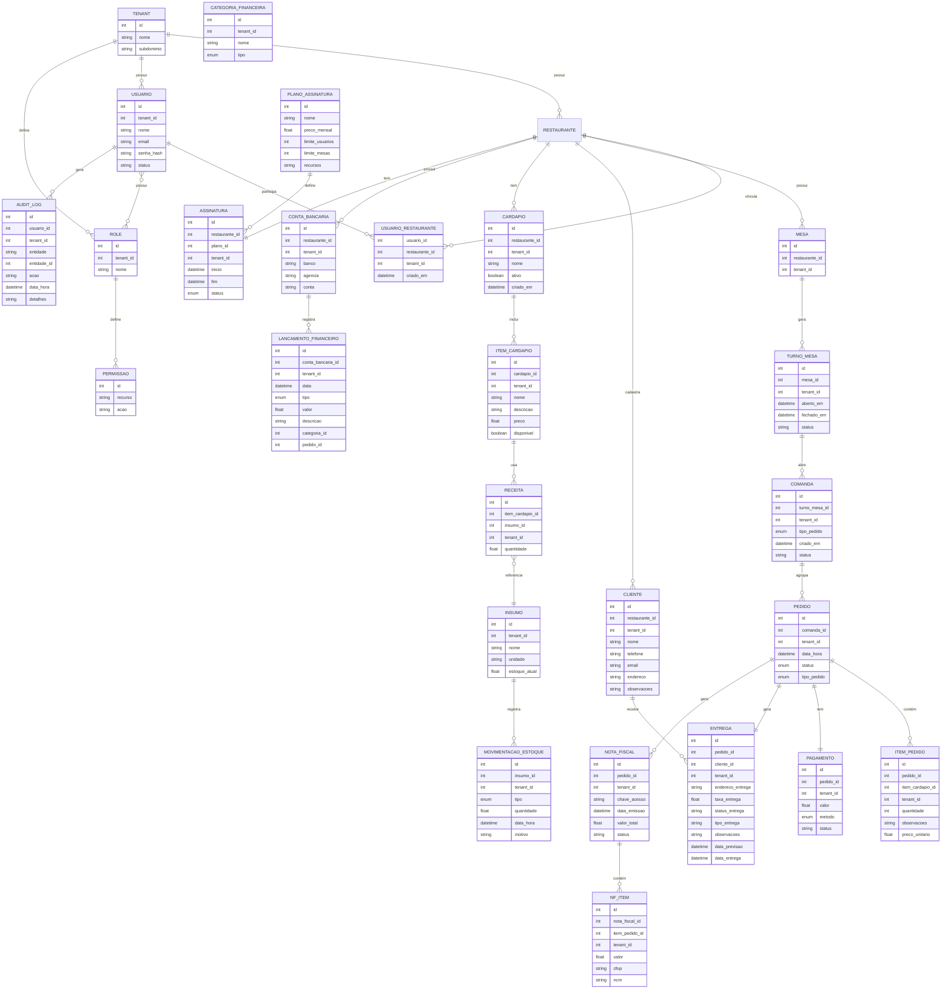

# MesaPro-Backend
SaaS para restaurantes e bares.

```mermaid
erDiagram
    %% Multi-tenancy
    TENANT ||--o{ RESTAURANTE : possui
    TENANT {
        int id
        string nome
        string subdominio
    }

    %% Entidades Principais
    TENANT ||--o{ USUARIO : possui
    RESTAURANTE ||--o{ USUARIO_RESTAURANTE : vincula
    USUARIO ||--o{ USUARIO_RESTAURANTE : participa
    USUARIO_RESTAURANTE {
        int usuario_id
        int restaurante_id
        int tenant_id
        datetime criado_em
    }
    USUARIO {
        int id
        int tenant_id
        string nome
        string email
        string senha_hash
        string status
    }

    %% Roles e Permissões
    USUARIO }o--o{ ROLE : possui
    TENANT ||--o{ ROLE : define
    ROLE ||--o{ PERMISSAO : define
    ROLE {
        int id
        int tenant_id
        string nome
    }
    PERMISSAO {
        int id
        string recurso
        string acao
    }

    %% POS / Comandas / Mesas
    RESTAURANTE ||--o{ MESA : possui
    MESA ||--o{ TURNO_MESA : gera
    TURNO_MESA ||--o{ COMANDA : abre
    MESA {
        int id
        int restaurante_id
        int tenant_id
    }
    TURNO_MESA {
        int id
        int mesa_id
        int tenant_id
        datetime aberto_em
        datetime fechado_em
        string status
    }
    COMANDA {
        int id
        int turno_mesa_id
        int tenant_id
        enum tipo_pedido
        datetime criado_em
        string status
    }

    %% Clientes (para Delivery)
    RESTAURANTE ||--o{ CLIENTE : cadastra
    CLIENTE ||--o{ ENTREGA : recebe
    CLIENTE {
        int id
        int restaurante_id
        int tenant_id
        string nome
        string telefone
        string email
        string endereco
        string observacoes
    }

    %% Pedidos e itens
    COMANDA ||--o{ PEDIDO : agrupa
    PEDIDO ||--o{ ITEM_PEDIDO : contém
    PEDIDO ||--|| PAGAMENTO : tem
    PEDIDO ||--|| ENTREGA : gera
    PEDIDO {
        int id
        int comanda_id
        int tenant_id
        datetime data_hora
        enum status
        enum tipo_pedido
    }
    ITEM_PEDIDO {
        int id
        int pedido_id
        int item_cardapio_id
        int tenant_id
        int quantidade
        string observacoes
        float preco_unitario
    }
    PAGAMENTO {
        int id
        int pedido_id
        int tenant_id
        float valor
        enum metodo
        string status
    }
    ENTREGA {
        int id
        int pedido_id
        int cliente_id
        int tenant_id
        string endereco_entrega
        float taxa_entrega
        string status_entrega
        string tipo_entrega
        string observacoes
        datetime data_previsao
        datetime data_entrega
    }

    %% Cardápio e Estoque
    RESTAURANTE ||--o{ CARDAPIO : tem
    CARDAPIO ||--o{ ITEM_CARDAPIO : inclui
    ITEM_CARDAPIO ||--o{ RECEITA : usa
    RECEITA }o--|| INSUMO : referencia
    CARDAPIO {
        int id
        int restaurante_id
        int tenant_id
        string nome
        boolean ativo
        datetime criado_em
    }
    ITEM_CARDAPIO {
        int id
        int cardapio_id
        int tenant_id
        string nome
        string descricao
        float preco
        boolean disponivel
    }
    RECEITA {
        int id
        int item_cardapio_id
        int insumo_id
        int tenant_id
        float quantidade
    }
    INSUMO {
        int id
        int tenant_id
        string nome
        string unidade
        float estoque_atual
    }

    %% Movimentações do Estoque
    INSUMO ||--o{ MOVIMENTACAO_ESTOQUE : registra
    MOVIMENTACAO_ESTOQUE {
        int id
        int insumo_id
        int tenant_id
        enum tipo
        float quantidade
        datetime data_hora
        string motivo
    }

    %% Nota Fiscal Eletrônica
    PEDIDO ||--o{ NOTA_FISCAL : gera
    NOTA_FISCAL ||--o{ NF_ITEM : contém
    NOTA_FISCAL {
        int id
        int pedido_id
        int tenant_id
        string chave_acesso
        datetime data_emissao
        float valor_total
        string status
    }
    NF_ITEM {
        int id
        int nota_fiscal_id
        int item_pedido_id
        int tenant_id
        float valor
        string cfop
        string ncm
    }

    %% Financeiro / Contábil
    RESTAURANTE ||--o{ CONTA_BANCARIA : possui
    CONTA_BANCARIA ||--o{ LANCAMENTO_FINANCEIRO : registra
    CONTA_BANCARIA {
        int id
        int restaurante_id
        int tenant_id
        string banco
        string agencia
        string conta
    }
    LANCAMENTO_FINANCEIRO {
        int id
        int conta_bancaria_id
        int tenant_id
        datetime data
        enum tipo
        float valor
        string descricao
        int categoria_id
        int pedido_id
    }
    CATEGORIA_FINANCEIRA {
        int id
        int tenant_id
        string nome
        enum tipo
    }

    %% Assinaturas / SaaS
    RESTAURANTE ||--|| ASSINATURA : tem
    PLANO_ASSINATURA ||--o{ ASSINATURA : define
    ASSINATURA {
        int id
        int restaurante_id
        int plano_id
        int tenant_id
        datetime inicio
        datetime fim
        enum status
    }
    PLANO_ASSINATURA {
        int id
        string nome
        float preco_mensal
        int limite_usuarios
        int limite_mesas
        string recursos
    }

    %% Auditoria
    USUARIO ||--o{ AUDIT_LOG : gera
    AUDIT_LOG {
        int id
        int usuario_id
        int tenant_id
        string entidade
        int entidade_id
        string acao
        datetime data_hora
        string detalhes
    }

```
